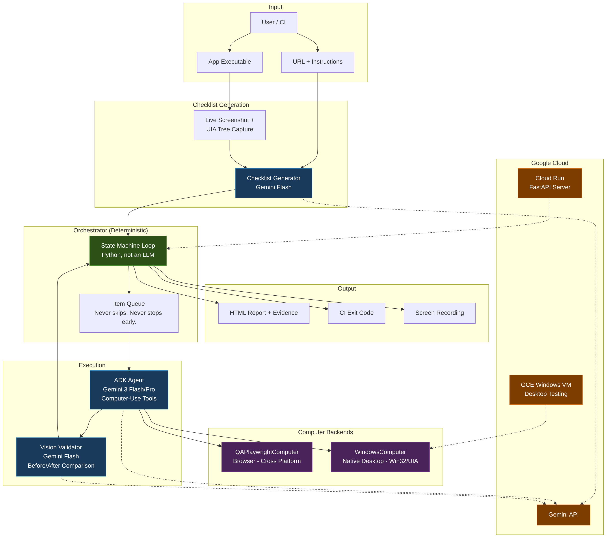

# QA Navigator

Visual QA testing agent that actually tests everything. Not 10%, not "the important parts" — everything.

The problem with giving an LLM a test plan is that it'll check three things, say "looks good," and move on. QA Navigator generates a comprehensive checklist of every testable element, then drives a Gemini computer-use agent through each item one by one. It collects before/after screenshots as evidence and won't stop until every item is addressed.

Works on browsers (Playwright) and native Windows desktop apps (Win32/UIA).



---

## Quick Setup

Add AI-powered UI testing to your repo's CI/CD in 30 seconds:

```bash
curl -sL https://raw.githubusercontent.com/bigwolfeman/qa-navigator/master/setup.sh | bash
```

Or clone and run locally:

```bash
git clone https://github.com/bigwolfeman/qa-navigator.git
cd qa-navigator
./setup.sh
```

The wizard detects your repo, asks what to test, and generates the right CI config (GitHub Actions, GitLab CI, or Cloud Run).

---

## Two Modes

### Mode 1 — One-shot Test Run

Point it at a URL or app, get a full report. Good for exploratory testing, demos, or verifying a specific build.

```bash
uv venv && source .venv/bin/activate
uv pip install -e ".[server]"
playwright install chromium

export GOOGLE_API_KEY="your-key"

# Browser
python -m qa_navigator \
  --url https://your-app.com \
  --instructions "Test all interactive features"

# Native Windows desktop
python -m qa_navigator \
  --url "Notepad" \
  --computer windows \
  --app-exe notepad.exe \
  --app-title "Notepad" \
  --instructions "Test file operations and text editing"
```

Produces an HTML report with before/after screenshots for every test item and exits with code 0 (all pass) or 1 (failures).

---

### Mode 2 — CI/CD Pipeline

Maintains a library of replayable automation scripts in `qa_scripts/`. Runs on every PR. Gets faster over time as the script library grows.

```bash
# First run — explores the full UI, generates scripts, saves them
python -m qa_navigator \
  --url https://your-app.com \
  --ci \
  --script-dir qa_scripts/ \
  --headless

# Subsequent runs — replays saved scripts, explores only what's new
python -m qa_navigator \
  --url https://your-app.com \
  --ci \
  --script-dir qa_scripts/ \
  --headless
```

CI mode runs three phases:

1. **Replay** — Runs all saved scripts from `qa_scripts/`. No Gemini generation calls needed. Fast.
2. **Explore** — Compares the live UI against what scripts already cover. Generates new scripts for any uncovered elements.
3. **Report** — Commits new scripts back to the branch, produces HTML report, exits with CI code.

When a PR removes or renames a UI element, scripts that reference it fail and get regenerated automatically. New elements get new scripts. The script library is version-controlled alongside the app — reviewable in PR diffs the same way as unit tests.

Run `./setup.sh` to generate a workflow for your repo, or use the included example at `.github/workflows/qa-test.yml`.

See [qa_scripts/PLAYBOOK.md](qa_scripts/PLAYBOOK.md) for the full CI playbook.

---

## Deploy to Cloud Run (Server Mode)

```bash
export GCP_PROJECT_ID="your-project"
export GOOGLE_API_KEY="your-key"
./deploy.sh
```

Builds with Cloud Build, pushes to Artifact Registry, deploys to Cloud Run. FastAPI server exposes async job endpoints (`POST /run`, `GET /jobs/{id}`).

---

## Architecture

The orchestrator is a deterministic Python state machine — not an LLM. An LLM orchestrator will skip items or declare early success. A `for` loop won't.

For CI mode: Gemini Flash generates and maintains the scripts. The scripts themselves are deterministic and replayable without any AI calls.

See [docs/architecture.md](docs/architecture.md) for the full diagram.

---

## Results

- **90% pass rate** on TodoMVC React (9/10 items, browser mode)
- **100% pass rate** on Notepad (4/4 items, native desktop mode)

---

## Tech

- Google ADK 1.25 + ComputerUseToolset
- Gemini 3 Flash (checklist generation, script design, vision validation)
- Gemini 3 Pro / Flash (computer-use agent)
- Playwright (browser backend)
- pywin32 + uiautomation (Windows desktop backend)
- FastAPI (server mode)
- Google Cloud Run + GCE Windows VM

## Project Structure

```
qa_navigator/
├── orchestrator/          # Deterministic state machine + test executor
├── checklist/             # Gemini-powered checklist generation
├── ci/                    # CI runner: Replay → Explore → Report phases
├── agents/                # ADK agent factory
├── computers/             # Playwright (browser) + Windows (native) backends
├── scripts/               # Saved automation script library
├── server/                # FastAPI async job server
├── report/                # HTML report generator
├── host_core/             # Windows input/capture/focus (Win32 APIs)
├── adapters/              # UIA + Win32 + Vision element detection
└── config.py              # pydantic-settings, env vars (QA_NAV_ prefix)
```
